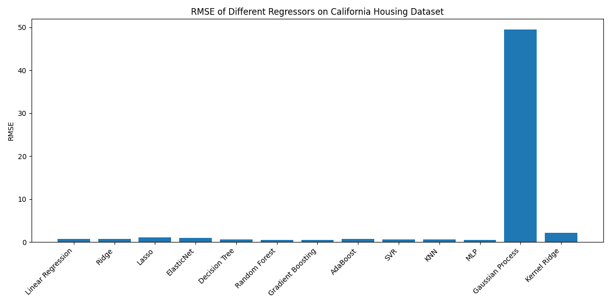

# California Housing Regression Project

This project compares the performance of 13 regression models on the [California Housing dataset](https://scikit-learn.org/stable/datasets/real_world.html#california-housing-dataset) to predict median house prices. It evaluates models using Root Mean Squared Error (RMSE) and visualizes the results in a bar plot. The project is implemented in a Jupyter Notebook, running in a Python virtual environment (`venv`) in PyCharm, without Conda dependencies.

## Project Overview

- **Objective**: Predict house prices using regression and compare model accuracy.
- **Dataset**: California Housing (20,640 samples, 8 features like median income, house age).
- **Models**: Linear Regression, Ridge, Lasso, ElasticNet, Decision Tree, Random Forest, Gradient Boosting, AdaBoost, SVR, KNN, MLP, Gaussian Process, Kernel Ridge.
- **Metric**: RMSE (lower is better).
- **Output**: Bar plot comparing RMSE scores, saved as `rmse_comparison.png`.

## RMSE Bar Plot

Below is the RMSE comparison for the 13 regressors:



*Note*: Ensemble models like Gradient Boosting and Random Forest typically show lower RMSE (~0.45–0.50), indicating better performance.

## Files

- `Regression_Models_RMSE.ipynb`: Jupyter Notebook with code, outputs, and instructions.
- `rmse_comparison.png`: Bar plot of RMSE scores.
- `Regression_Models_RMSE.html`: HTML export of the notebook (optional, for non-Jupyter users).

## Setup Instructions

To run the project locally:

1. **Prerequisites**:
   - Python 3.8+ installed (`python --version`).
   - PyCharm (recommended) or Jupyter Notebook.
2. **Clone the Repository**:
   ```bash
   git clone https://github.com/yourusername/California-Housing-Regression.git
   cd California-Housing-Regression
   ```
3. **Create a Virtual Environment**:
   - In PyCharm: File → Settings → Project → Python Interpreter → Add Interpreter → Virtualenv Environment → Set Location to `<project_folder>/venv`.
   - Or via terminal:
     ```bash
     python -m venv venv
     ```
4. **Activate the Environment**:
   - PyCharm: Automatically uses `venv` if set.
   - Terminal (Windows):
     ```powershell
     .\venv\Scripts\Activate.ps1
     ```
5. **Install Dependencies**:
   ```bash
   pip install numpy scikit-learn matplotlib jupyter ipykernel
   ```
6. **Register Jupyter Kernel**:
   ```bash
   python -m ipykernel install --user --name venv --display-name "Python (venv)"
   ```
7. **Run the Notebook**:
   - In PyCharm: Open `Regression_Models_RMSE.ipynb`, select `Python (venv)` kernel, run all cells.
   - Or via terminal:
     ```bash
     jupyter notebook
     ```
   - Open `Regression_Models_RMSE.ipynb`, run all cells.

## Results

- **Step 0**: Verifies environment (e.g., `scikit-learn: 1.2.2`).
- **Step 3**: Prints RMSE for each model.
- **Step 4**: Generates `rmse_comparison.png` (embedded above).

## Notes

- The dataset predicts median house values (in $100,000s) using features like `MedInc` and `HouseAge`.
- Ensemble methods (e.g., Gradient Boosting) often outperform linear models due to nonlinear relationships.
- Default hyperparameters are used; consider `GridSearchCV` for tuning.
- Built with debugging skills (e.g., resolved `numpy`, `scikit-learn` errors), inspired by my work on [UNSW-NB15, GSoC `PURLdb`].

## Acknowledgments

- Built with `scikit-learn`, `numpy`, and `matplotlib`.

*Mohannad, April 2025*
